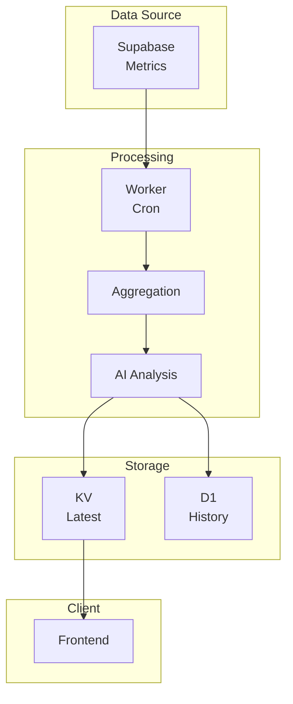

# fs-lab-cloud

Cloud infrastructure layer for the **fs-lab** project.

---

## 🧠 Overview

This repository contains the cloud-based backend responsible for:

- collecting performance snapshots
- running AI-based analysis
- storing results for retrieval and visualization

The system is designed around **edge computing with serverless execution**.

---

## 🏗️ Architecture



## ⚙️ Components

### ☁️ Cloudflare Workers

- Handles API endpoints
- Executes scheduled jobs (cron)
- Orchestrates the data pipeline

---

### 🤖 AI Analysis

- Uses multiple models (e.g. LLaMA, Mistral)
- Compares backend services (Go, Node, Python)
- Produces structured performance insights

---

### 🗄️ Storage

#### KV (Key-Value)

- Stores latest analysis result
- Optimized for fast read access

#### D1 (SQLite)

- Stores historical analysis reports
- Enables long-term tracking

---

### 🧪 Supabase

- Source of raw performance snapshots
- Queried during analysis runs

---

## 🔁 Data Flow

1. Cron triggers Worker (daily)
2. Worker fetches snapshot data from Supabase
3. Data is aggregated
4. AI models generate analysis
5. Results are:
   - stored in KV (latest)
   - persisted in D1 (history)
6. Frontend consumes `/kv-latest`

---

## 🌐 API Endpoints

| Endpoint     | Description                                                 |
| ------------ | ----------------------------------------------------------- |
| `/kv-latest` | Latest analysis (KV cache)                                  |
| `/d1-test`   | Latest persisted DB record                                  |
| `/run-now`   | Triggers manual analysis (dev only, protected via ENV flag) |

---

## ⏱️ Scheduling

Configured via Cloudflare cron triggers:

```json
"triggers": {
  "crons": ["0 2 * * *"]
}
```

- Runs once per day
- Time is in UTC

---

## 🧩 Design Decisions

- Edge-first architecture → low latency, no servers
- KV for fast reads → optimized for frontend
- D1 for persistence → historical tracking
- AI used for interpretation, not as source of truth

---

## ⚠️ Limitations

- AI output may contain minor inconsistencies
- No deterministic ranking implemented yet
- No authentication layer (development stage)

---

## 🛠️ Development

### Run locally

```bash
wrangler dev
```

### Run against remote resources (D1, KV, etc.)

```bash
wrangler dev --remote
```

### Deploy worker

```bash
wrangler deploy
```

---

## 🎯 Purpose

This project explores:

- serverless cloud architecture
- edge computing patterns
- AI-assisted data analysis pipelines
